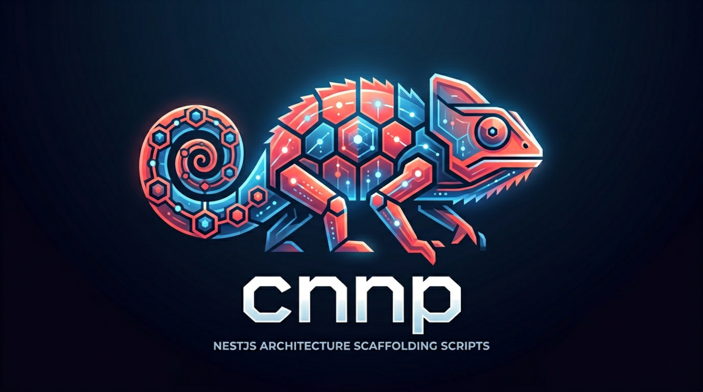

<p align="center">
  
</p>

# cnnp — Create New NestJS Project


CLI tool that scaffolds a production-ready NestJS project with a pre-defined architecture, directory structure, and dependencies already installed.

## Prerequisites

- Node.js 18+
- NestJS CLI: `npm i -g @nestjs/cli`
- One of: `pnpm`, `npm`, or `yarn`

## Installation

Clone this repository and make the scripts executable:

```bash
git clone <repo-url>
cd cnnp
chmod +x cnnp architectures/clean
```

Optionally, add it to your PATH so you can run it from anywhere:

```bash
echo 'export PATH="$PATH:/path/to/cnnp"' >> ~/.zshrc
source ~/.zshrc
```

## Usage

```bash
cnnp --pn <project-name> --pk <package-manager> --a <architecture>
```

### Options

| Flag | Alias | Description | Required |
|------|-------|-------------|----------|
| `--pn` | `--project-name` | Project name | ✅ |
| `--pk` | `--package` | Package manager: `pnpm` \| `npm` \| `yarn` | ✅ |
| `--a` | `--architecture` | Architecture type: `clean` | ✅ |
| `--dir` | `--directory` | Target directory (defaults to current) | ❌ |
| `--skip-install` | | Skip dependency installation | ❌ |
| `--skip-git` | | Skip git initialization | ❌ |

### Examples

```bash
cnnp --pn auth-api --pk pnpm --a clean
cnnp --pn users-service --pk npm --a clean --dir ./projects
cnnp --pn payment-api --pk yarn --a clean --skip-install
```

## Architectures

### `clean`

Hexagonal/Clean architecture focused on domain isolation. Includes a full auth flow out of the box.

Generates a pre-filled `.env.example` at the project root — copy it to `.env` and fill in your secrets.

**Database:** PostgreSQL. The template requires two schemas inside a single database: `trn` (transactional data) and `cat` (catalogues / reference data). Both must be created before running migrations.

See [docs/architecture-clean.md](docs/architecture-clean.md) for the complete structure and conventions.  
See [docs/database-setup.md](docs/database-setup.md) for database configuration and schema conventions.

## Project structure

```
cnnp/
├── architectures/
│   └── clean             # Clean architecture template
├── docs/
│   └── architecture-clean.md
├── cnnp                  # CLI entry point
└── README.md
```